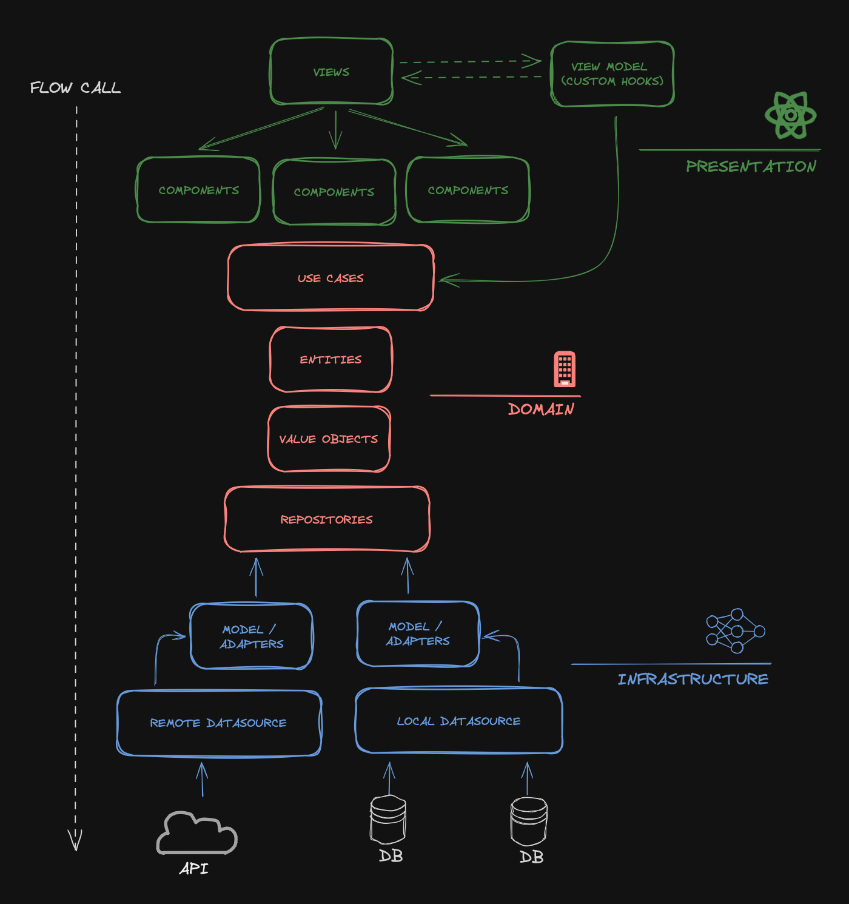

# Calculadora de tipo de cambio

## Descripción

Esta aplicación permite calcular el tipo de cambio entre dos monedas, utilizando la API de https://www.vatcomply.com/documentation.

## Arquitectura de la aplicación

La aplicación está desarrollada bajo principios de Clean Architecture y Vertical Slicing.
Esta solucion busca separar la lógica de negocio de la lógica de presentación, permitiendo que la aplicación sea más fácil de mantener y extender.

Se utilizó el patrón de presentación MVVM, ya que permite mantener los componentes encargado de renderizar la UI de forma limpia.

Se utilizaron patrones de componentes como Compound Components, Render Props, Custom Hooks y Composition para mantener la lógica de presentación desacoplada.

## Gráfico de arquitectura



## Instalación

Para instalar las dependencias del proyecto, ejecutar el siguiente comando:

```
npm install
```

Para ejecutar el proyecto, ejecutar el siguiente comando:

```
npm run dev
```

El proyecto se ejecutará en http://localhost:5173 por defecto.

- O ingresar en https://exchange-calculator-five.vercel.app

## Documentación API REST

https://www.vatcomply.com/documentation

## Guía de UX/UI

https://www.figma.com/file/pXwlwP49aKLoTJqHj7jWQR/Currency-exchange?type=design&node-id=0-1&mode=design

## Consideraciones

### UX/UI

- Se optó por utilizar el radius de 4px de forma general para mantener la consistencia en el diseño.
- Se alinearon los inputs y el botón de inversión de campos para mantener la consistencia en el diseño.
- El footer se mantiene como parte de la card en la vista de mobile para mantener la consistencia en el diseño.
- Se limitó el ancho de la card a 1300px para mantener la consistencia en el diseño.

### Funcionalidad

- Se limitaron los decimales a 2.
- Se limitó el input de moneda a 10 caracteres.
- Se sanitizó la lista de monedas disponibles solo por aquellas que continen un rate de conversión.

## Estructura de carpetas

```
├── src
│ ├── App.tsx
│ ├── common
│ │ ├── domain
│ │ ├── infrastructure
│ │ ├── presentation
│ │ │ ├── components
│ │ │ │ ├── app_components
│ │ │ │ └── icons
│ │ │ ├── hooks
│ │ │ └── providers
│ │ └── utils
│ ├── features
│ │ └── exchange_calculator
│ │ ├── domain
│ │ │ ├── datasource
│ │ │ ├── entities
│ │ │ ├── repositories
│ │ │ ├── usecases
│ │ │ └── value_objects
│ │ ├── infrastructure
│ │ │ ├── adapters
│ │ │ ├── datasoruces
│ │ │ │ └── remote
│ │ │ ├── repositories
│ │ │ ├── types
│ │ │ └── usecases
│ │ └── presentation
│ │ ├── components
│ │ ├── constants
│ │ ├── contexts_providers
│ │ ├── hooks
│ │ ├── view_model
│ │ └── views
│ ├── index.css
│ ├── main.tsx
```

- Common: Contiene elementos comunes a toda la aplicación, como componentes, hooks, providers y utilidades.
- Features: Contiene las funcionalidades de la aplicación, separadas por carpetas (Vertical Slicing).
  - Domain: Contiene los elementos de dominio de la funcionalidad, como entidades, repositorios, casos de uso y objetos de valor. En este punto se define la lógica de negocio de la funcionalidad, y se disparan las excepciones de dominio.
  - Infrastructure: Contiene los elementos de infraestructura de la funcionalidad, como adaptadores y estrategias de implementación. En este punto se implementa la lógica de negocio de la funcionalidad, y se controlan los errores para ser servidos de manera controlada a la capa de presentación.
  - Presentation: Contiene los elementos de presentación de la funcionalidad, como componentes, constantes, contextos, hooks, view models y vistas. React es la librería de UI utilizada para la implementación de la capa de presentación.

## Dependencias

- sweet-monads/either: monadas para control de errores
- axios: cliente HTTP
- formik: formularios
- framer-motion: animaciones
- react: librería de UI
- react-currency-input-field: input de moneda
- react-dom: renderizado de la aplicación
- react-hot-toast: notificaciones
- react-shimmer-effects: efectos de carga
- yup: control de validaciones
